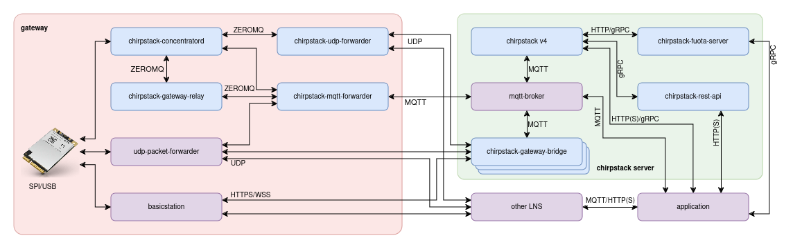

# ChirpStack Gateway Mesh service for Docker

This is an **unofficial** built of the ChirpStack Gateway Mesh service meant to be deployed using docker. The binaries included with this image are built using the chirpstack-gateway-mesh fork under https://github.com/xoseperez/chirpstack-gateway-mesh and may have small differences with the original binaries (check the repo for more info).

Please refer to the original sources of the project whenever possible, contribute and donate to Orne for his great work: https://github.com/chirpstack/chirpstack-gateway-mesh

ChirpStack Gateway Mesh is an open-source LoRa(WAN) gateway mesh implementation, part of the ChirpStack project. It requires other components in order to build a viable LoRaWAN solution: chirpstack-concentratord and chirpstack-mqtt-forwarder (for the border gateway).

## Chirpstack Gateway Mesh service variables

These variables you can set them under the `environment` tag in the `docker-compose.yml` file or using an environment file (with the `env_file` tag). 

Variable Name | Value | Description | Default
--- | --- | --- | ---
**`LOGGING_LEVEL`** | `STRING` | Set concentratord debug level (TRACE, DEBUG, INFO*, WARN, ERROR, OFF) | `INFO`
**`RELAY_BORDER`** | `true` or `false` | Set to `true` if this is a border gateway | `false`
**`RELAY_SIGNING_KEY`** | `STRING` | Key to sign the relayed messages for tampering protection (32 chars) | `00000000000000000000000000000000`
**`RELAY_MAX_HOP_COUNT`** | `INT` | Maximum number of hops a relayed payload will pass | 1
**`RELAY_BORDER`** | `true` or `false` | Set to `true` if this is a border gateway | `false`
**`RELAY_IGNORE_DIRECT`** | ``true` or `false`` | For a border gateways, set to `false` to ignore direct messages (only relayed messages will be processed) | `false`
**`RELAY_REGION`** | `STRING` | Defines the relay band to use, helpful to auto-configure the frequencies to use. Possible values: `eu868`, `us915` and `ism2400` | `eu868`
**`RELAY_FREQUENCIES`** | `STRING` | Frequencies to use for relaying. If `RELAY_REGION` above is set these have correnponding defaults  | *empty*
**`RELAY_TX_POWER`** | `INT` | Mesh TX power. Defaults to 10dBm for ISM2400 band, 16dBm otherwise | `10` or `16`
**`RELAY_MODULATION`** | `STRING` | Modulation to use for relaying. Possible values: `LORA` and `FSK` | `LORA`
**`RELAY_SF`** | `INT` | Spreading factor to use when relaying. Applies only to LORA modulation | `7`
**`RELAY_BANDWIDTH`** | `INT` | Bandwidth in Hz to use when relaying. Applies only to LORA modulation | `125000`
**`RELAY_CODERATE`** | `STRING` | Code-rate to use when relaying. Applies only to LORA modulation | `4/5`
**`RELAY_FSK_BITRATE`** | `INT` | Bitrate to use when relaying. Applies only to FSK modulation | `0`
**`RELAY_SOCKET_DEVICES`** | `STRING` | Socket name to connect to concentratord service listening/sending to end-devices | `concentratord`
**`RELAY_SOCKET_RELAY`** | `STRING` | Socket name to connect to concentratord service listening/sending to other relay gateways or border gateways | `concentratord`
**`RELAY_SOCKET_FORWARDER`** | `STRING` | Socket name to connect to chirpstack-mqtt-forwarder service in a border gateway | `forwarder`

     
## Use

Check the included `docker-compose.yml` file for a usage example.

## License

ChirpStack Gateway Mesh is distributed under the MIT license (and so is this repository). See LICENSE.

